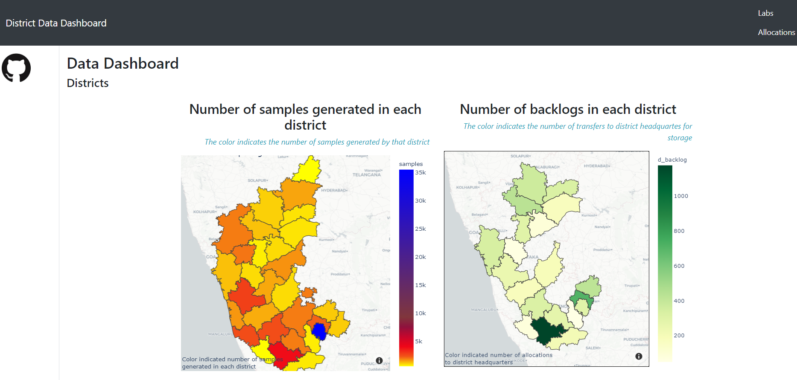

# swab2lab_hack

* View deployed application: http://quartz14.pythonanywhere.com/

To tackle the task of testing individuals for covid19 on a large scale, swab tests are taken at each district. The samples collected at the districts, needs to be sent to the labs, where the actuall testing takes place. The question now is how can we decide which district sample, and how much quantity is to be sent, and to which lab such that the overall cost and backlogs is reduced.

This was the problem statement of the Swabs2Labs Hackathon 2020, jointly conducted by Indian Institute of science (IISC) and Cisco
A dashboard containing the visualizations is developed, to easily understand the allocation process
Screenshots of application: 

1.Dashboard

2. Samples transferred

To Run: 
* cd swabs
* python swabtolabapp.py
